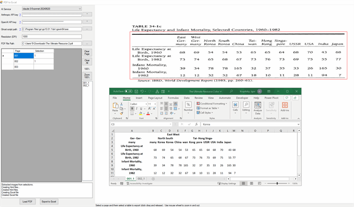

# Export PDF To Excel using AI

Originally posted here:
<https://www.codeproject.com/Articles/5386724/PDF-To-Excel/>

This application shows to to use OpenAI or Anthropic Vision API to export a PDF file to Excel.

# Introduction
This application will convert PDF to Excel by using the following steps:

1. Convert PDF to JPG using Ghostscript 
2. Let user select table(s) to export to Excel
3. Extract the selected images and resize them to confirm to the vison API (2,000px max for OpenAI and 1,092px max for Anthropic)
4. Use OpenAI or Anthropic Vision API to convert image to HTML
5. Convert HTML files to one Excel file using VBA
 

Using the code
1. Get Anthropic API key https://console.anthropic.com/settings/keys
2. Get OpenAI API key https://platform.openai.com/settings/profile?tab=api-keys
3. Download and Install Ghostscript

The code  uses HttpClient to post JSON to OpenAI (https://api.openai.com/v1/chat/completions) and Anthropic (https://api.anthropic.com/v1/messages) endpoints.  It encodes the image file using base64 encoding.

The application will resize large images before sending them to Vision API.  So be carful not to select very large tables because the image quality will suffer and the AI will start to hallucinate.

I attempted to OCR the image (using tesseract-ocr) and send it along with the request but it only confused the AI...

Next step would be to try to export the PDF to a database this bridging the unstructured and structured data boundary!
